# Artboards

This is an autogenerated file showing all the artboards. Do not edit it directly.

## 45 BTC

## Arrow_menu

## BTC_block

## BTC_contract_hash

## BTC_transaction_hash

## Background

## Background_menu

## Background_menu_close

## Batton_table_blue

## Bitcoin

## Bitcoin_Transaction

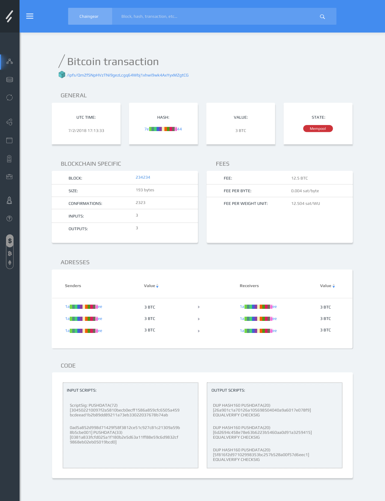

## Bitcoin__Block

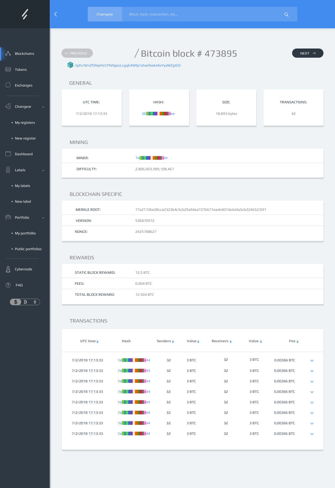

## Bitcoin__Block_(tab_2)

## Bitcoin_contract

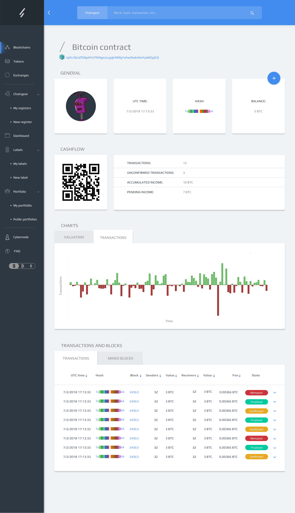

## Bitcoin_contract_(tab_2)

## Bitcoin_contract_(tab_3)

## Button_round

## Button_table_gray

## Button_table_green

## Caption_block_BTC

## Confirmed

## Container

## Created

## Dashboard

## Dollar

## ETH_hash

## Ethereum

## Ethereum_Block

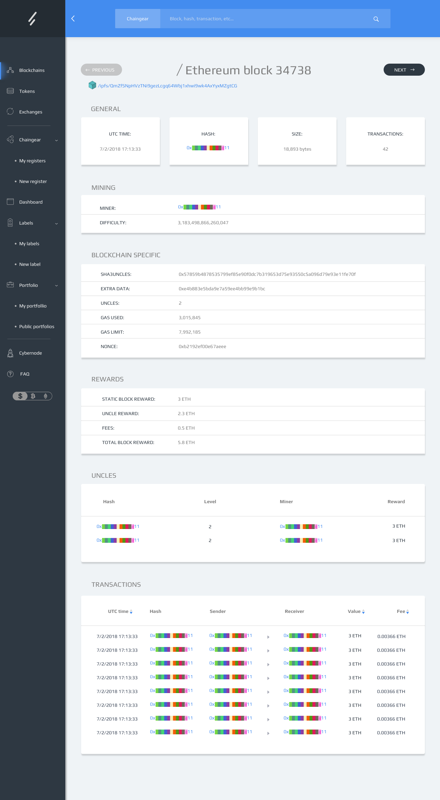

## Ethereum_Contract

## Ethereum_Contract_(tab_2)

## Ethereum_Contract_(tab_3)

## Ethereum_Contract_(tab_4)

## Ethereum_Contract_(tab_5)

## Ethereum_Transaction

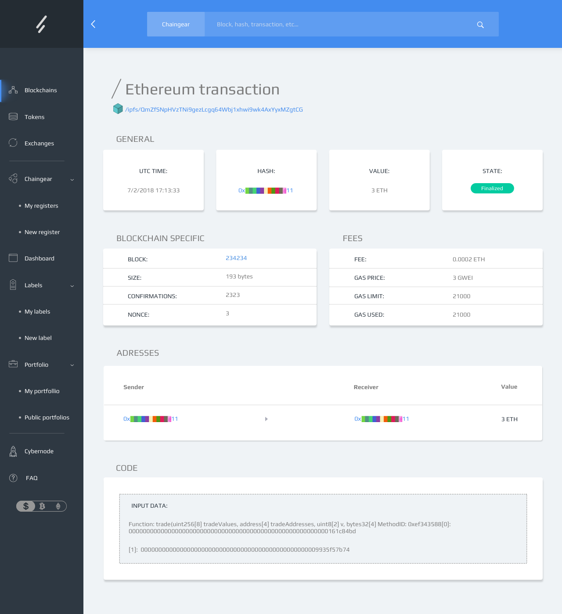

## Ethereum_Uncle

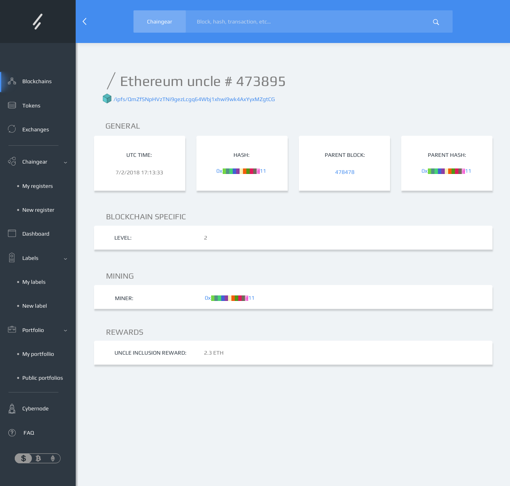

## Exchange

## FAQ

## Filter

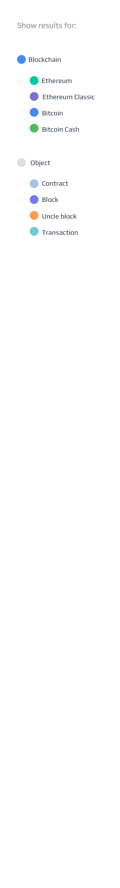

## Finalis

## Finalized

## GitHub

## IPFS

## IPFS_2

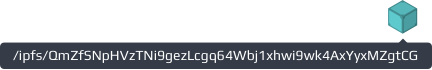

## Icon

## Knowledge

## Logo

## Main_page

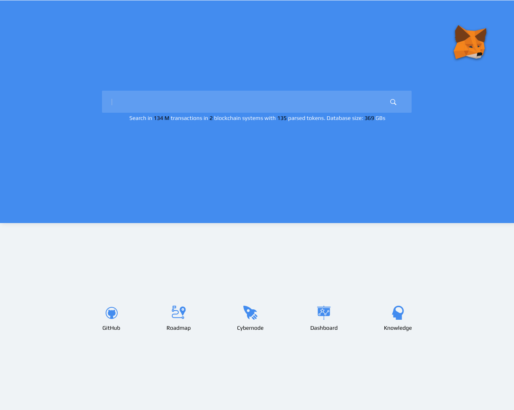

## Main_page_(tab_2)

## Mempool

## Menu_active

## Metamask_shit

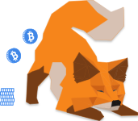

## Metamask_sleep

## Qr

## Results_Page

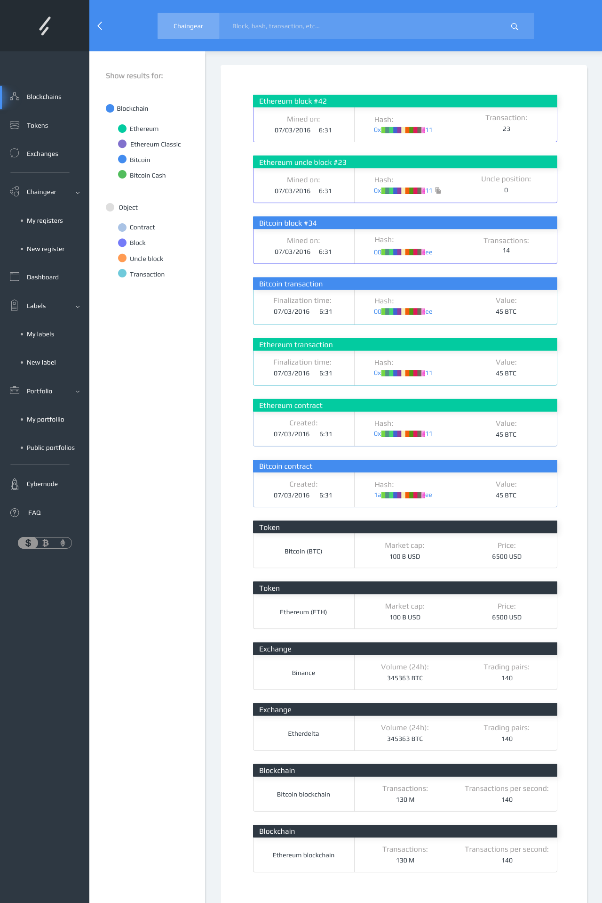

## Roadmap

## Search_bar

## Search_bar_close_side_bar

## Sidebar

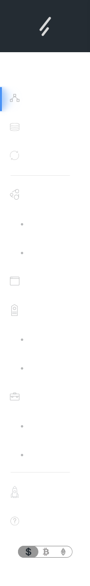

## Sidebar_close

## Simple Fast Icons EXT

## Token

## UI

## arrow

## baseline-file_copy-24px

## block

## blockchain_specific_block_BTC

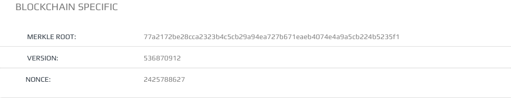

## blockchain_specific_block_ETH

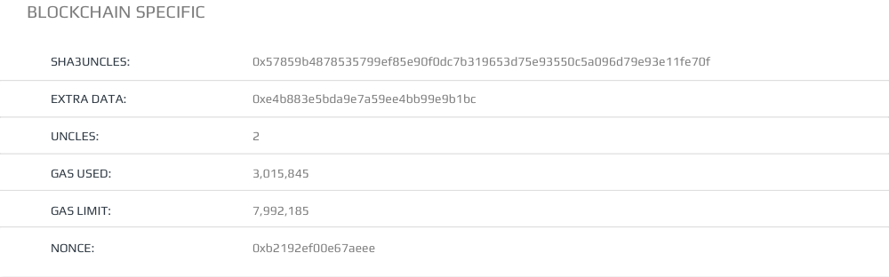

## brain

## btn

## btn_!

## btn_2

## chaingear

## cybernode

## entity_active

## fox_portfolio

## general_block_BTC

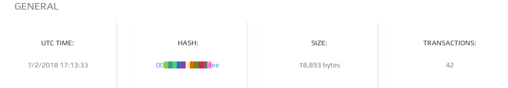

## general_block_ETH

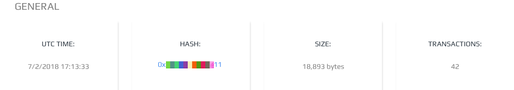

## il_robohash

## label

## menu

## metamask

## mined on

## mining_block_BTC

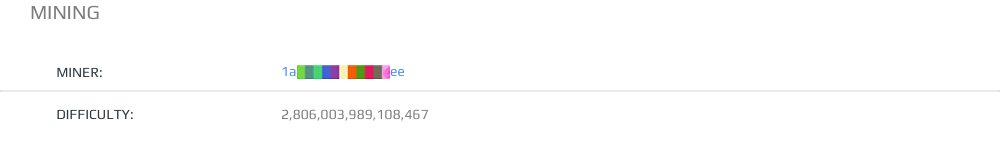

## mining_block_ETH

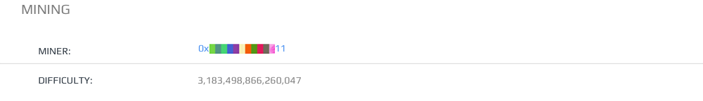

## portfolio

## projection

## rewards_block_BTC

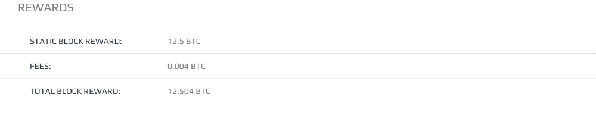

## rewards_block_ETH

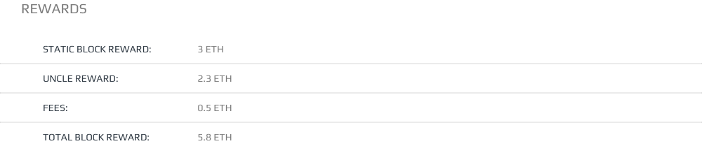

## route

## search_main

## startup

## tabs

## value

