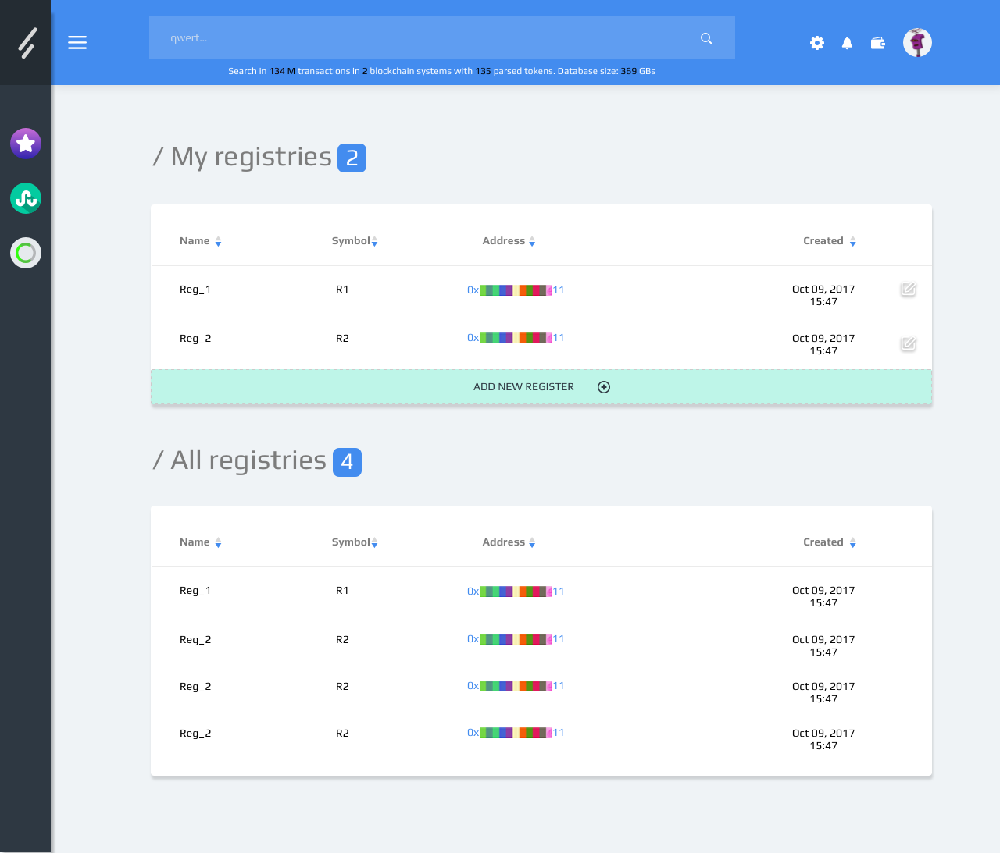
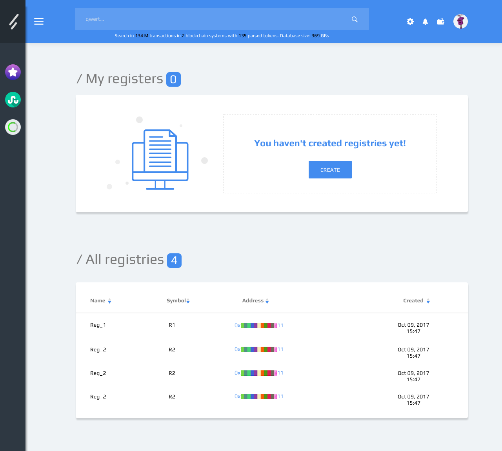
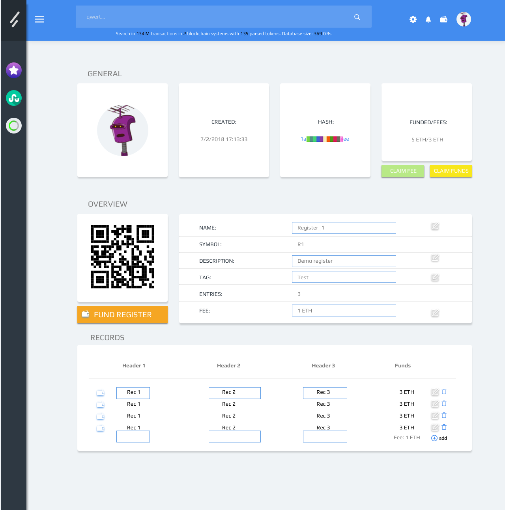
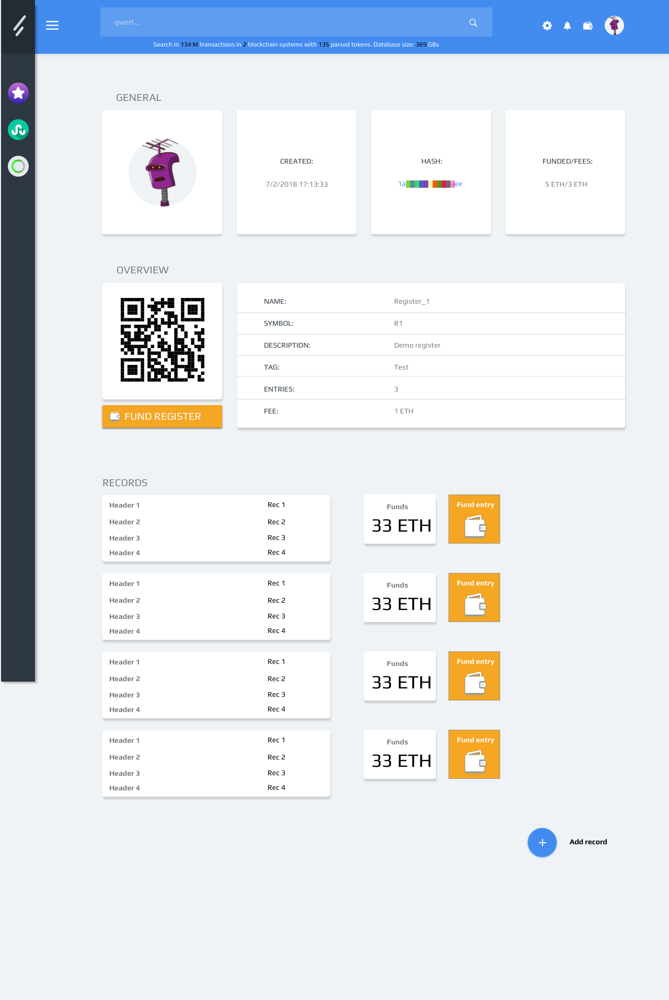
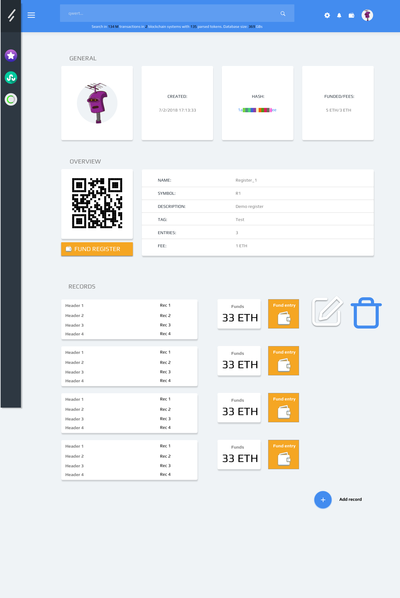
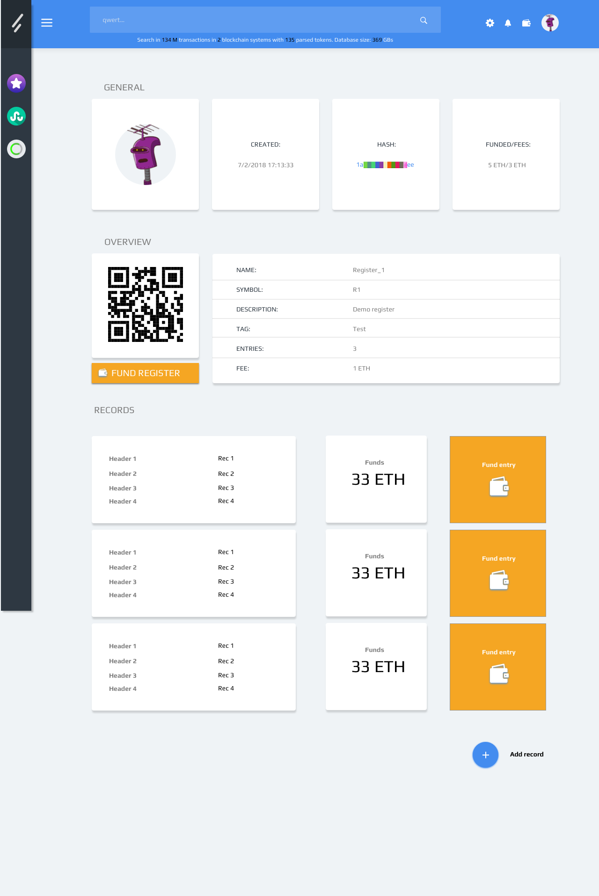
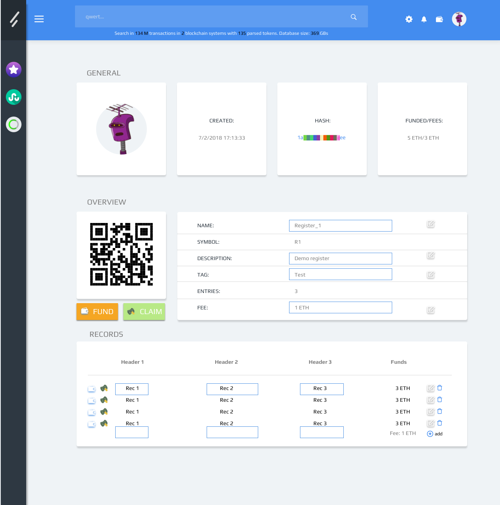
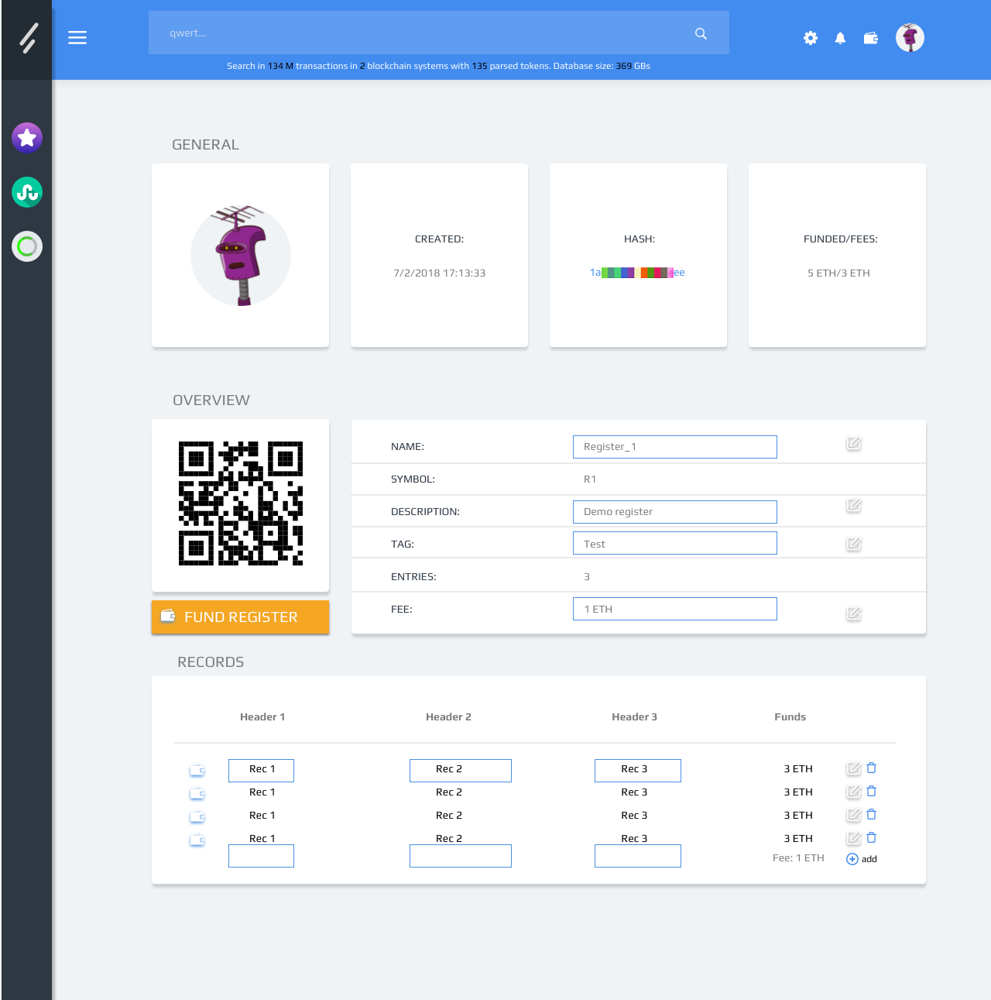

# Artboards

This is an autogenerated file showing all the artboards. Do not edit it directly.

## Arrow_menu

## Background_menu

## Dropdown

## Edit

## Home

## Home_empty

## Icon

## Input

## Material

## New register

## Plus

## Rec

## Register_claim_2

## Register_view

## Register_view_2

## Register_view_3

## Register_view_claim

## Register_view_edit

## Registry deloying

## Search_bar

## Search_bar_close_side_bar

## Sidebar

## UI

## arrow

## ic_add_black_24px

## ic_arrow

## ic_clear_black_24px

## ic_create

## ic_create_black_24px

## ic_delete

## ic_edit

## ic_plus

## ic_remove

## ic_vertical_align_bottom_black_24px

## il_comp

## il_robohash

## il_trash

## logo

## logo_2

## star

## style

## wallet_1

