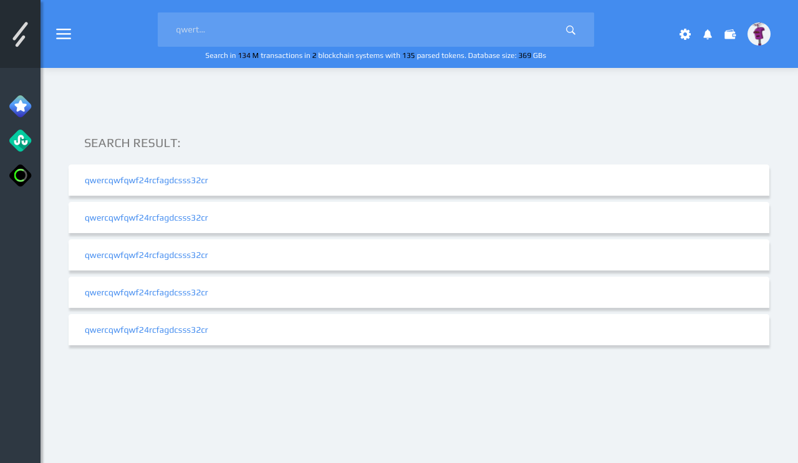
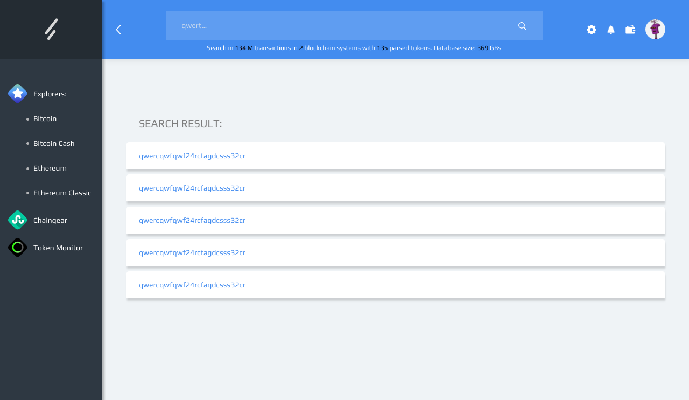

# Artboards

This is an autogenerated file showing all the artboards. Do not edit it directly.

## Background_menu

## Filter

## Mempool

## Search_bar

## Search_bar_close_side_bar

## Shell_state_closed_menu

## Shell_state_opened_menu

## Sidebar

## arrow

## btn

## ic

## il_robohash

## links

## logo

## logo_2

## metamask

## search

## star

